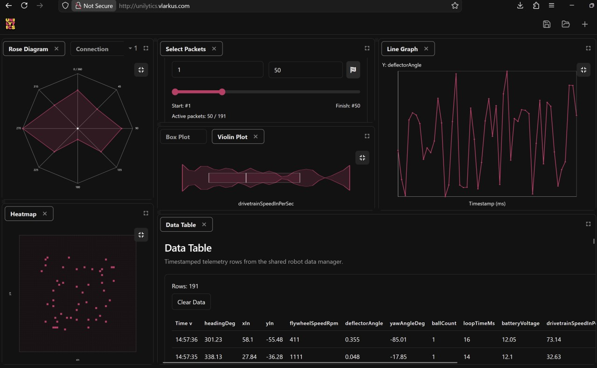
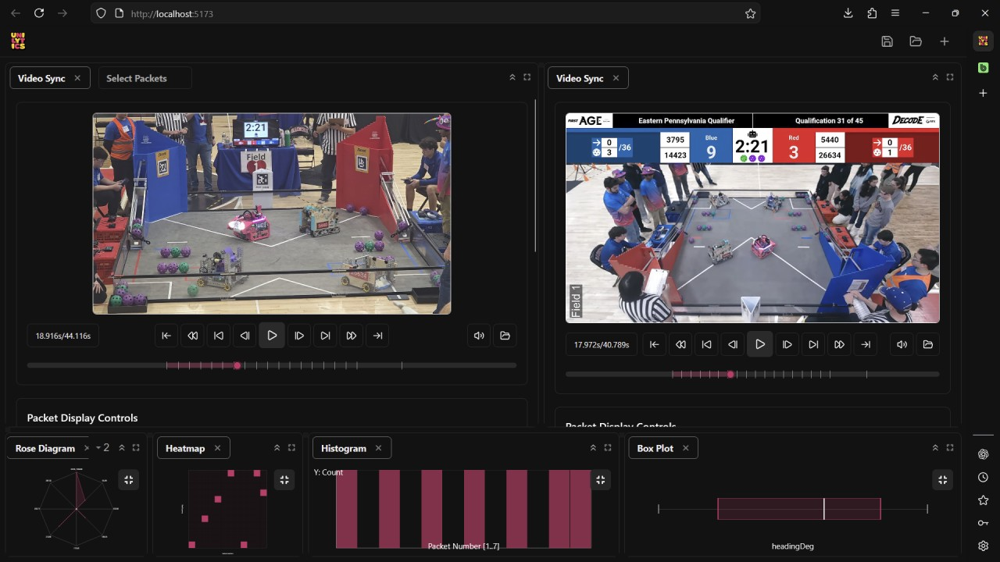

# Unilytics - Adaptive Telemetry Dashboard

Unilytics is a telemetry dashboard for FTC workflows.  
It lets you stream robot telemetry, inspect packets, select focused ranges, and visualize data across multiple analysis panels.

## Table of Contents
1. [Highlights](#highlights)
2. [Screenshots](#screenshots)
3. [Run Locally (localhost)](#run-locally-localhost)
4. [How to Use](#how-to-use)
5. [Ready-to-Use Apps](#ready-to-use-apps)
6. [Project Structure](#project-structure)
7. [Tech Stack](#tech-stack)
8. [License](#license)

## Highlights
- Live telemetry connection over WebSocket
- Built-in demo stream for quick testing (`demo`)
- Packet range selection shared across charts
- Multiple analysis panels (table, line, histogram, heatmap, pie, box plot, violin, and more)
- CSV export/import for offline review and replay
- Dockable workspace for custom layouts

## Screenshots




## Run Locally (localhost)
### Prerequisites
- Node.js 20+
- pnpm 10+

### Install and start
```bash
pnpm install
pnpm --filter web dev
```

Open: `http://localhost:5173`

## How to Use
1. Start the app locally and open it in your browser.
2. Add the **Robot Connection** panel.
3. Enter `demo` as the target and connect to generate telemetry instantly.
4. Add **Telemetry Table** to inspect incoming packets.
5. Add **Packet Selection** to choose the packet range used by charts.
6. Add chart panels (Line, Heatmap, Histogram, Pie, Box Plot, Violin, etc.) and select variables.
7. Use top-bar actions to save packets to CSV or open a CSV for replay.

### Connecting to a real telemetry stream
- Enter your robot host/IP in the Robot Connection panel.
- Use a WebSocket endpoint that sends JSON payloads.
- Supported payload patterns include:
  - Array of `{ "name": "...", "value": ... }`
  - Object containing `telemetry: [...]`
  - Flat object with primitive fields (number/string/boolean)

## Ready-to-Use Apps
For prebuilt distributable apps, use the repository Releases page:  
https://github.com/Vlarkus/Unilytics/releases

## Project Structure
```text
.
|- apps/
|  |- web/                # Main dashboard app (localhost workflow)
|  |- ...                 # Additional app targets
|- packages/
|  |- core/
|  |- panels/
|  |- shared/
|  |- transport/
|- docs/
|  |- images/
|     |- readme/          # README screenshots
|- package.json
|- pnpm-workspace.yaml
```

## Tech Stack
- React 19 + TypeScript
- Vite 7
- Tailwind CSS v4
- flexlayout-react
- pnpm workspaces

## License
MIT - see `LICENSE`.
